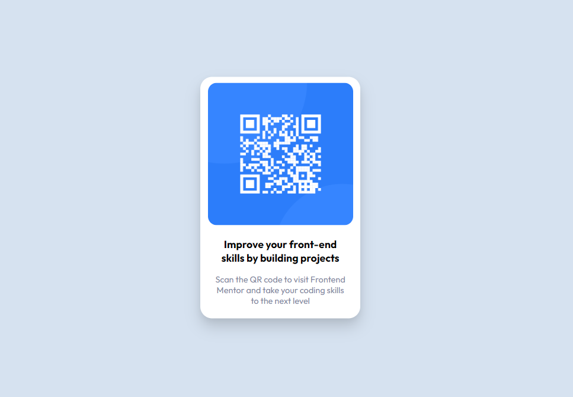

# Frontend Mentor - QR code component solution

Hello, This is my first project for [Frontend Mentor](https://www.frontendmentor.io/), even though it was a small project but it was quite fun while making it. I'm looking forward to learn more and grow further.

### Screenshot

### What I learned

I learned how to center a div (Not ashamed telling it). Learned about importing custom fonts, font properties, background-color propertery, color property, opacity property, padding/margin properties, etc.

### Built with

- Semantic HTML5 markup
- Responsive Design

### Useful resources

- [Hub Spot](https://blog.hubspot.com/website/center-div-css) - This helped me for centering div.

## Acknowledgments

- [Forbidden Shadow](https://github.com/ForbiddenShadow/) - My friend helped me with the box shadows and fonts.
